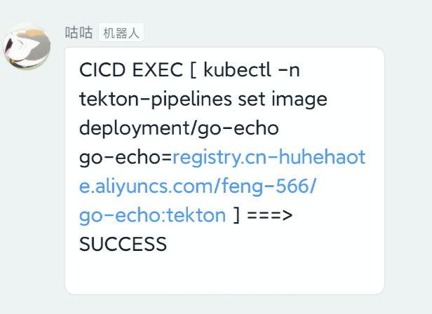
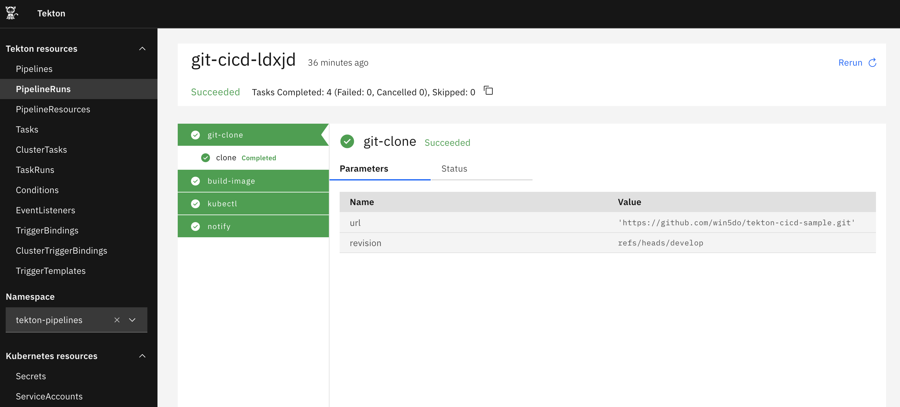

# Tekton CICD Demo

这是一个演示 Tekton CICD 的 demo。下面我们将从搭建本地 k8s 集群开始，同步镜像至国内并部署 Tekton，一步一步实现一个 CICD 流水线。实现更新代码自动触发流水线，构建镜像推送到目标仓库，并更新 deployment 镜像滚动更新应用，最后钉钉机器人通知到群聊。

[TOC]

## 前言

我心目中理想的CICD工具应该包含以下特性：
- 声明式配置，新增配置不需要在UI上操作，便于迁移，可使用git版本控制
- 配置与项目代码解耦，统一集中管理
- 灵活易扩展

Gitlab 和 Github 的 CICD 都是在当前 repo 中存放配置，对于开源项目一般就一个 repo 倒也没什么，但是在公司内部往往有很多服务很多 repo，配置散落在各个 repo 中，不方便统筹管理。

Jenkins 虽然可以将 Jenkinsfile 脚本集中管理，但针对每个项目还需要在 UI 上配置。Jenkins 也有相关插件 [configuration-as-code-plugin](https://github.com/jenkinsci/configuration-as-code-plugin)，没用过就不评价了。

而 Tekton 所有配置都是以 k8s 式 Yaml 文件形式存在，即使换了一个集群，只需要应用 Yaml 配置即可无缝迁移。

## 执行步骤

### 阅读须知

- 完成以下步骤需要 k8s 基础使用能力
- k8s server version >= v1.15
- 以下命令中 `alias kc=kubectl`
- Tekton 的一些概念和资源在此不再赘述，请查阅官方文档：https://tekton.dev/docs/pipelines/
- 以下步骤在 macOS 10.15 上测试通过，一些命令在 Windows 上可能没有。
- registry.cn-huhehaote.aliyuncs.com/feng-566/ 旗下镜像均可公开访问，但是推送镜像需要认证。所以需要一个镜像仓库用于推送制品镜像，推荐阿里云镜像仓库注册账号即可免费使用。
- 接收 github webhook 需要一个拥有公网 IP 的服务器。如果没有，可使用 pull 模式替代。
- 出现问题请先查看 [问题排查](#问题排查)

### 创建 kind 本地集群

使用 [kind](https://github.com/kubernetes-sigs/kind) 创建测试集群。如果你已有 k8s 集群可跳过此步。

```sh
cat <<EOF >kind-config.yaml
kind: Cluster
apiVersion: kind.x-k8s.io/v1alpha4
nodes:
- role: control-plane
- role: worker
EOF

kind create cluster --config ./kind-config.yaml
```

### 安装 Tekton

#### 同步镜像
由于 Tekton 镜像都是在 gcr.io 上，需要 VPN 才能拉取，所以第一步需要将镜像同步至国内。这里我写了脚本（./src/sync/main.go）将镜像都同步至阿里云镜像仓库，并设为公开访问，如无必要可跳过此步。

```sh
make sync
```
#### 部署 Tekton

部署 pipeline、trigger、dashboard 三个组件。

```sh
kc apply -f ./src/sync/dst
```

check：
```sh
kc get po
```

#### 部署 demo app

测试 demo，用于后面流水线滚动更新。

```sh
kc apply -f ./demo/go-echo/deploy/deploy.yaml
```

### 配置 pipeline
创建 Task 和 Pipeline 资源，每个 Task 为一个独立任务，Pipeline 则是将多个 Task 串成流水线。

更多 Task 例子可以在官方仓库找到：https://github.com/tektoncd/catalog

#### 配置 github 和 镜像仓库 access token
`./manifests/pipeline/sercret.yaml` 配置 github 和 docker registry。

将其中url， username， password 修改为你自己的 access token。


#### 配置目标集群 kubeconfig
`./manifests/resource/cluster-kind.yaml` 配置部署时 kubectl 使用的配置*。

将其修改为你本地 kind 集群的 kubeconfig。

#### 配置机器人通知

`./manifests/pipeline/notify.yaml` 配置执行成功后聊天机器人通知地址，可接入钉钉或企业微信。

钉钉机器人文档：https://ding-doc.dingtalk.com/doc#/serverapi2/qf2nxq

大家可自行创建团队测试机器人，不需要真实企业认证。

成功后钉钉会收到机器人通知：


#### 应用 pipeline 配置

```sh
kc apply -f ./manifests/pipeline
kc apply -f ./manifests/resource
```

#### test pipeline run

手动执行 PipelineRun，测试 pipeline 流程。

```sh
kc apply -f ./manifests/test/pipeline-run-demo.yaml
```

check：
```sh
kc get pr
```

#### Tekton dashboard
通过 dashboard 我们可以查看流水线执行状态。由于 kind 网络隔离的原因，此处我们使用 kc port-forward 将端口暴露出来。

```sh
kc port-forward svc/tekton-dashboard 9097

# new terminal session
# 打开浏览器
open http://localhost:9097/#/namespaces/tekton-pipelines/pipelineruns
```

流水线执行成功实例：



### [Option 1： push 模式] 配置 Tekton triggers

前面的步骤中，我们用手动的方式执行了 pipeline，下面我们配置 Tekton triggers，通过 webhok 的方式自动执行。

[Tekton trigger](https://github.com/tektoncd/triggers)  组件是用来接收 webhook，做一些 校验，过滤，参数绑定等前处理，然后帮你自动创建 PipelineRun 等资源执行流水线。

```sh
kc apply -f ./manifests/triggers
```

#### config webhook  in github repo

接收 webhook 需要一个拥有公网 ip 的服务器，首先在 github repo 中配置 webhook。

webhook 地址为 `http://<your-remote-host>:9080/tekton-el`，勾选 `Pull requests`，`Pushs` events，token 为 `./manifests/triggers/webhook-token.yaml`中的值。

webhook 配置参考文档： https://docs.github.com/en/free-pro-team@latest/developers/webhooks-and-events/webhooks

webhook playload 数据结构:
https://docs.github.com/en/free-pro-team@latest/developers/webhooks-and-events/webhook-events-and-payloads

#### 利用 ssh 将 webhook 转发到本地
将 kind 中 eventLister 端口暴露出来：
```sh
kc port-forward svc/el-demo-listener 9080:8080
```

服务端监听 0.0.0.0 需要 sshd 配置中包含 `GatewayPorts clientspecified`，详见： https://serverfault.com/questions/861909/ssh-r-make-target-host-accept-connection-on-all-interfaces

将服务器 9080 端口转发到本地 9080 端口：

```sh
ssh -N -R 0.0.0.0:9080:localhost:9080 <user>@<your-remote-host> -p 22
```
check port connected：
```sh
nc -v <your-remote-host> 9080
```

#### debug webhook
部署成功后参考 [测试 CICD](#测试-CICD) 中步骤进行测试。

可通过查看 eventLister 日志进行 debug：
```sh
kc logs -l eventlistener=demo-listener
```

`./manifests/triggers/print.yaml` print task 将 webhook head 及 body 打印出来。

### [Option 2： pull 模式] 配置 CronJob

Tekton 官方并没有提供类似 Jenkins 那种轮询 pull 检测 git repo，有新的 commit 则触发构建。理由是 pull 模式会对 git 造成较大压力。

但借助 k8s CronJob，自己实现 pull 模式。`./src/pull` 我实现了一个简单的 pull 程序，定期检查对应仓库和分支有没有新的 commit，自动创建 PipelineRun。

 `./src/pull/deploy/configmap.yaml` 为 PipelineRun 模板，修改 params 部分目标 IMAGE，NAME 等参数。

 `./src/pull/deploy/cronJob.yaml` 为 Pull 脚本定时任务， 修改 args 部分需监听的 repo，branch 等参数。

应用：
```sh
kc apply -f ./src/pull/deploy
```

部署成功后参考 [测试 CICD](#测试-CICD) 中步骤进行测试。

### 测试 CICD

提交 commit 进行测试：
```sh
git commit -a -m "build commit" --allow-empty && git push
```

## 后记

### 问题排查

#### build-image 卡主
build-image 使用 kaniko，不依赖 docker daemon，所以 Dockerfile 中如果使用 golang:1.14 等体积很大的 dockerhub 镜像，因网络问题下载很慢甚至失败，会导致 build 超时，最好将镜像同步至内网。

#### git clone auth err
检查  secret `git-auth` 是否配置正确。

#### push image auth err
检查  secret `docker-auth` 是否配置正确。pipeline 中推送镜像地址是否改为你个人镜像仓库地址。

#### run on openshift
部分任务配置了 `securityContext.runAsUser: 0`，在 openshift 运行需要配置 `scc=anyuid`。 参考：
https://docs.openshift.com/container-platform/4.6/authentication/managing-security-context-constraints.html

### TODO
- pipeline 中途失败无法发送机器人通知
